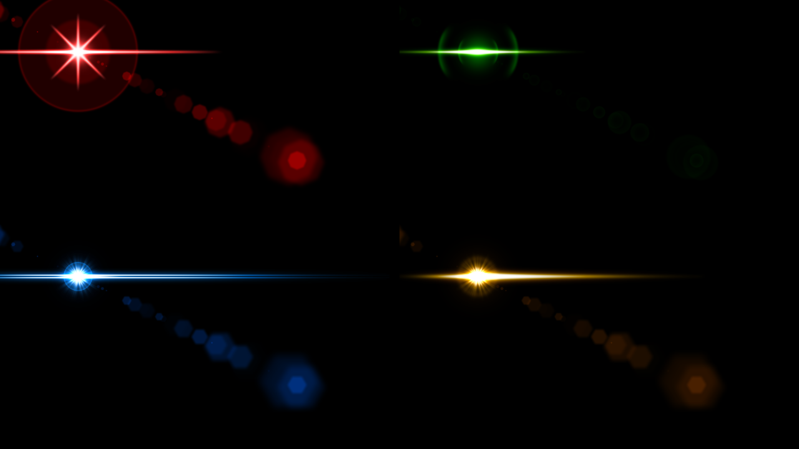

# Sci Fi Flares

# Usage
<h2>With a standard editor</h2>
In your photo editor (Photoshop, etc.) create guides at the point for the flare center to be. Check the document's dimensions, as well as the X and Y where the guides intersect. Go to <a href="https://yikuansun.github.io/sci-fi-flares/">https://yikuansun.github.io/sci-fi-flares/</a> and edit the information on the right, or choose a preset. If you would like to share a preset, please use a pull request.
<h2>As a Photopea plugin</h2>
<a href="https://www.photopea.com#%7B%22environment%22:%7B%22plugins%22:%5B%7B%22name%22:%22Sci-Fi%20Flares%20By%20Yikuan%20Sun%22,%22url%22:%22https://yikuansun.github.io/sci-fi-flares/%22,%22width%22:750,%22height%22:400,%22icon%22:%22https://yikuansun.github.io/sci-fi-flares/icon.png%22%7D%5D%7D%7D">Open this link</a>. Open the plugin using the F icon on the menu on the right. On your Photopea document, use guides to find out the X and Y position where the flare needs to be. Edit the boxes in the plugin; when the preview is statisfying, press "add to document." A new document will be opened; close the popup using the same F icon, then drag the layer in the new document into the previous document.